# 带视野的中国象棋

我在传统中国象棋游戏中引入了 “视野” 这一说法，即仿照常见网络对抗游戏（典型的像农药）中的设定——不能轻易获得对方的位置信息。具体来说引入了以下几条规则：

$\qquad$ 1：己方棋子总是可见的。

$\qquad$ 2：位于己方半区中的对方棋子总是可见的。

$\qquad$ 3：位于对方半区中的对方棋子只有处在己方可以攻击的位置才是可见的。


下面是同一局面时双方的视野情况：

<div align=center>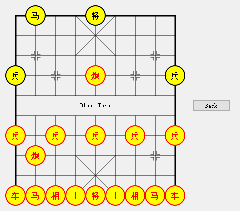</div>

<div align=center>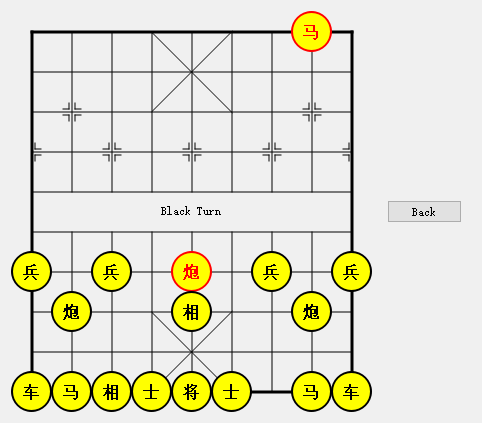</div>

<br> 

```客户端```

基于 Qt5.9.9(MinGW5.3.0) 和 Qt Creator4.11.0, 目前支持单机版和网络对战版。后续会支持更多的功能，如规则展示界面，用户展示界面，加入声音，或者动画。

<br>

```服务端```

因为服务器需要处理的请求不是很多暂时没有使用一些流行的游戏服务器框架，只是用到了一些中间件，日志用的是log4cpp，通信协议用的是protobuf，数据库用的MySQL。服务器主要负责处理的有4类请求：登录，注册，开始网络游戏，网络游戏结算。一局游戏的主要过程如下：


<div align=center>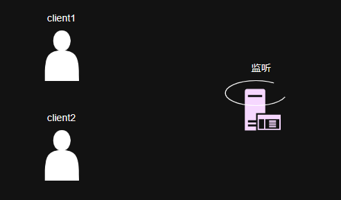</div>

<div align=center>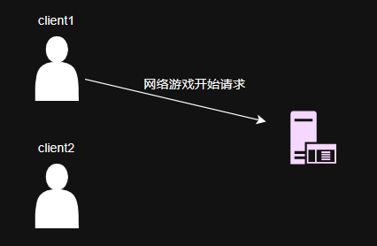</div>

<div align=center>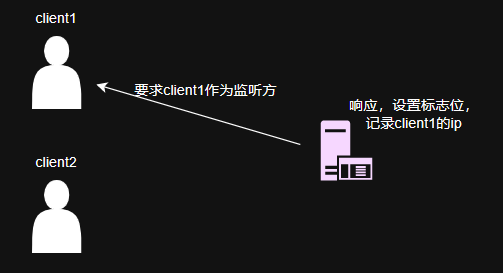</div>

<div align=center>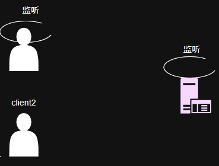</div>

<div align=center>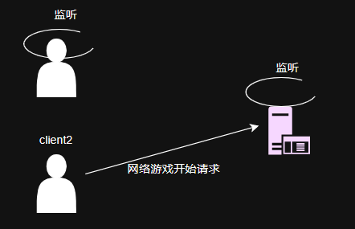</div>

<div align=center>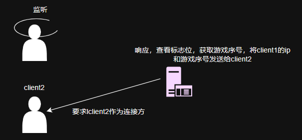</div>

<div align=center>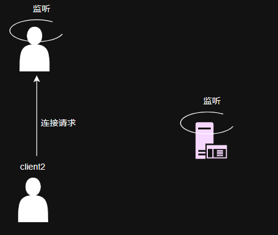</div>

<div align=center>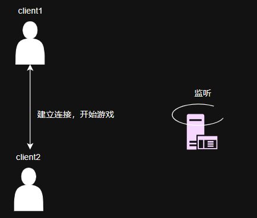</div>

<div align=center>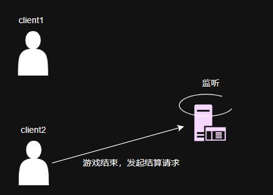</div>

<div align=center>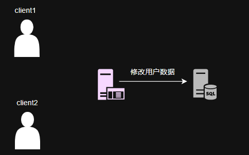</div>

<br>

目前考虑到数据量并不大，对用户数据的缓存机制采用的是全部缓存，即服务器启动便将数据库中的用户表全部读到内存中，后续修改都是基于该缓存。后续会肯定会升级到部分缓存，或引入redis。